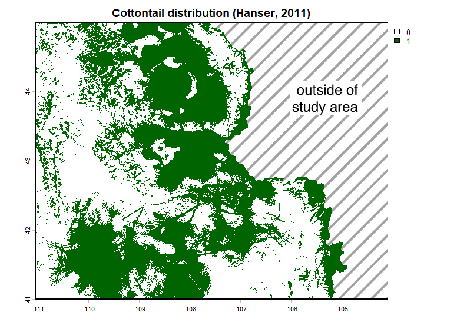

# Wyoming-USGS-vis
The goal of Wyoming-USGS-vis is to provide examples of GIS data visualisations,
using publicly accessible data from the USGS Science Data Catalog and other data sources.



## About the data

Wyoming elevation data are made available through the `elevatr` package in R. You can 
install the released version of elevatr from [CRAN](https://CRAN.R-project.org) with:

``` r
install.packages("elevatr")
```

[Cottontail distribution data](https://doi.org/10.5066/P917D1PK) and 
[historical evapotranspiration data](https://doi.org/10.5066/P9EZ3VAS) 
are made available through the USGS Science Data Catalog (SDC). Cottontail data 
originate from [Dr. Steven Hanser](https://orcid.org/0000-0002-4430-2073) and 
[Dr. Matthias Leu](https://orcid.org/0000-0002-4290-7212). Historical evapotranspiration 
data originate from [Dr. Meredith Reitz](https://orcid.org/0000-0001-9519-6103), 
[Dr. Ward Sanford](https://orcid.org/0000-0002-6624-0280), and 
[Dr. Samuel Saxe](https://orcid.org/0000-0003-1151-8908). I am grateful to the 
researchers who share their data sets to make projects like this possible.

## Data preparation

This project uses clean, publication-quality data sets which are ready to use out of 
the box. All data can be loaded in through the `terra` package in R, authored by 
[Dr. Robert Hijmans](https://orcid.org/0000-0001-5872-2872).

The cottontail data comprise a series of ADF files with a .adf extension. These files 
should be extracted into a single directory.

The evapotranspiration data comprise several compressed sets of TIF and TFW files 
(.tif and .tfw). The TIF files contain high-quality raster images, while the TFW 
files contain georeferencing information for the associated TIFs. All TIF and TFW 
files should be extracted into a single directory.

## File organisation

The `scripts` directory of this repository contains all of the scripts necessary to 
visualise these data. The `outputs` directory contains the results of these scripts. 
Note that `AET_sampleframe.png` is one of many PNG files produced by the 
`visualising_AET.R` script. Additionally, `cottontaildist_modified.png` has undergone 
post-processing in graphics software to identify the limits of the study area. The 
raw output of the `cottontail_map.R` script can be seen in `cottontaildist.png`.

## Acknowledgements and contact information

Again, I am grateful to the researchers who share their data sets to make projects 
like this possible. I would also like to acknowledge a LinkedIn post by 
[Dr. Michael Sunde](https://orcid.org/0000-0001-9394-2416), which inspired this 
project in the first place! Finally, I highly recommend 
[Spatial Statistics for Data Science: Theory and Practice with R](https://www.paulamoraga.com/book-spatial) 
by [Dr. Paula Moraga](https://orcid.org/0000-0001-5266-0201). Part I on Spatial 
Data was particularly helpful here.

If you have any questions or would like clarification on anything, please feel free 
to contact me at JasperEHunt at gmail dot com.
